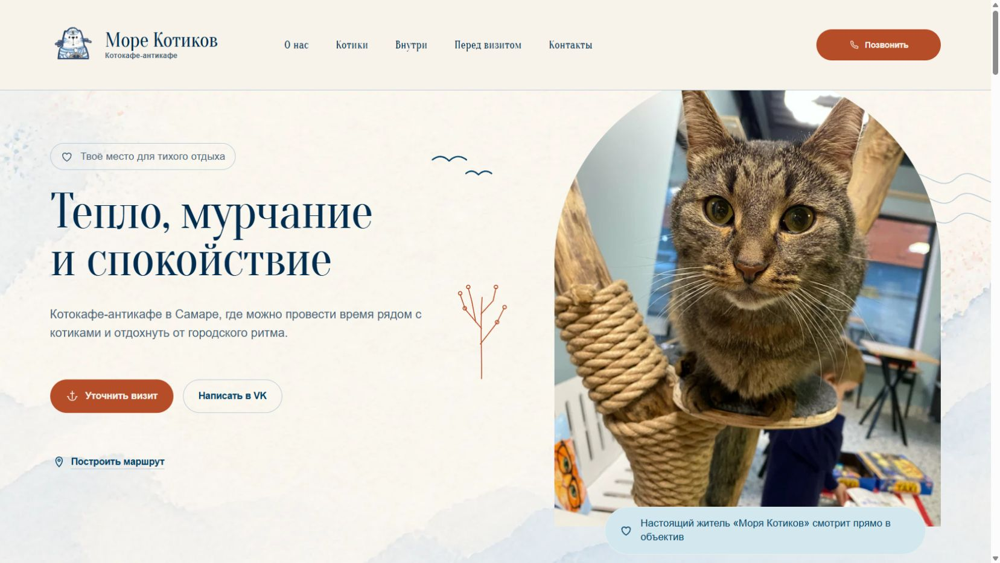

# Море Котиков

Демонстрационный сайт самарского котокафе-антикафе. Адаптивная страница с фотографиями, описанием формата, галереей и прямыми ссылками для связи и построения маршрута.



## Реализация

Astro, React и TypeScript. Оптимизированные локальные изображения, доступная навигация, мобильная вёрстка, unit-тесты и браузерные сценарии Playwright.

## Локальный запуск

Node.js 22.12 или новее.

```bash
npm ci
npm run dev
```

Адрес: [127.0.0.1:4327/seaofcats/](http://127.0.0.1:4327/seaofcats/).

```bash
npm run check
npm run test:unit
npm run build
```

Для браузерных тестов: `npm run test:install`, затем `npm run test:e2e`.

## Источники и статус

Материалы первоначальной проверки, реестр изображений и инструкции по размещению сохранены в [IMPLEMENTATION.md](IMPLEMENTATION.md). Публичная GitHub Pages-публикация не гарантируется самим наличием открытого репозитория.

Портфолио-демо, не заявление об официальном сотрудничестве. Фотографии и бренд имеют собственных правообладателей. Скриншот взят из сохранённых браузерных проверок; данные о заведении и результаты тестов не перепроверялись при обновлении README.
